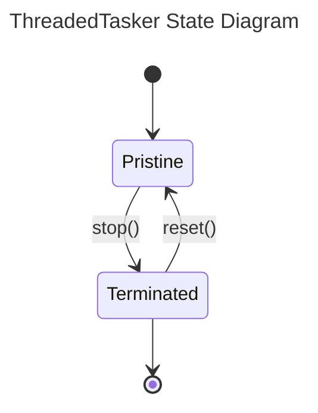

# Fs2a utilities

This repository includes some utilities the author uses for easier and faster development of
C++ projects.

## Classes documentation

### ThreadedTasker

This is a template class with two parameters. It follows the following state diagram:

## Followed standards

The author of this project does his best to adhere to the following standards:

* [Conventional Commits v1.0.0](https://www.conventionalcommits.org/en/v1.0.0/)
* [GitHub flow](https://docs.github.com/en/get-started/using-github/github-flow)
* [Semantic Versioning v2.0.0](https://semver.org/spec/v2.0.0.html)

## Used software and technologies

The following software and technologies are used in this library:

* [C++20](https://en.wikipedia.org/wiki/C%2B%2B20)
* [CMake](https://cmake.org/) version 3.1 or higher
